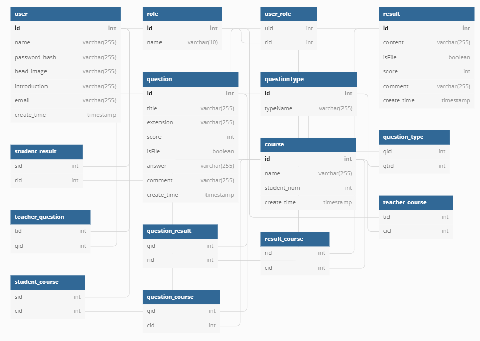
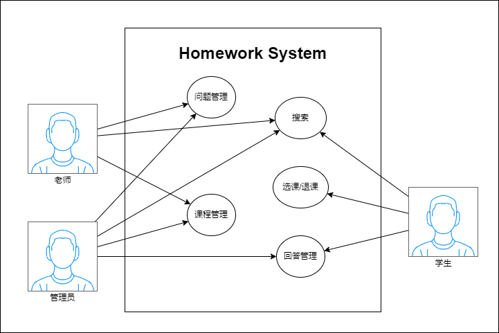

# 电子作业系统的设计和开发

### 使用技术栈

> 并不会创建微服务的集群(没有资源)

1. **Spring Cloud Alibaba** 微服务框架
    1. Nacos 服务注册和配置管理
    2. Sentinel 流量控制
2. **Spring Cloud** 微服务框架
    1. Gateway 后端网关
    2. OpenFeign 微服务通信
3. **Spring Boot** 服务框架
3. **Nginx** 网络服务器进行 Nacos 的负载均衡
4. **Redis** 缓存
5. **ElasticSearch** 搜索
6. **RabbitMQ** 消息队列 异步通信
6. **Docker/Docker-Compose** 部署测试

### 设计模型

[数据库设计模型](https://dbdiagram.io/d/62beb8df69be0b672c7e89f2) 
系统框架 

顶级用例图 

+ 数据库设计工具: [dbdiagram](https://dbdiagram.io/home)
+ 系统架构设计工具: [diagrams.net](https://github.com/jgraph/drawio-desktop)

#### 细分

1. User
2. Homework
3. Course
4. Creator
5. Respondent
6. CourseManager
7. Teacher
8. Student
9. Admin
10. Register