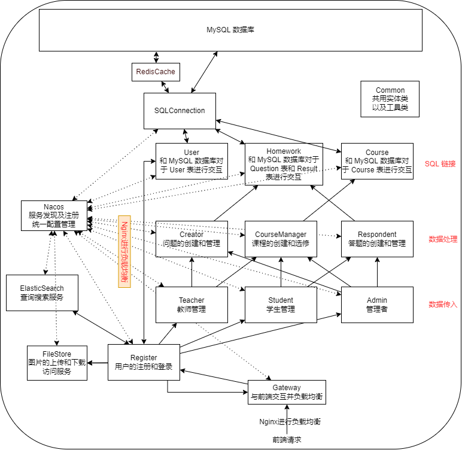

# 电子作业系统的设计和开发

### 使用技术栈

1. **Spring Cloud Alibaba** 微服务框架
    1. Nacos 服务注册和配置管理
    2. Sentinel 流量控制
2. **Spring Cloud** 微服务框架
    1. Gateway 后端网关
    2. OpenFeign 微服务通信
3. **Spring Boot** 服务框架
4. **Redis** 缓存
5. **ElasticSearch** 搜索
6. **RabbitMQ** 消息队列 异步通信

### 设计模型

[数据库设计模型](https://dbdiagram.io/d/62beb8df69be0b672c7e89f2) 
系统框架 

+ 数据库设计工具: [dbdiagram](https://dbdiagram.io/home)
+ 系统架构设计工具: [diagrams.net](https://github.com/jgraph/drawio-desktop)
+ 细分
    1. User
    2. Homework
    3. Course
    4. Creator
    5. Respondent
    6. CourseManager
    7. Teacher
    8. Student
    9. Admin
    10. Register